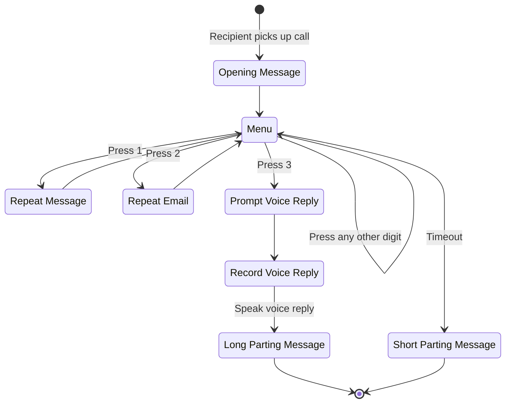
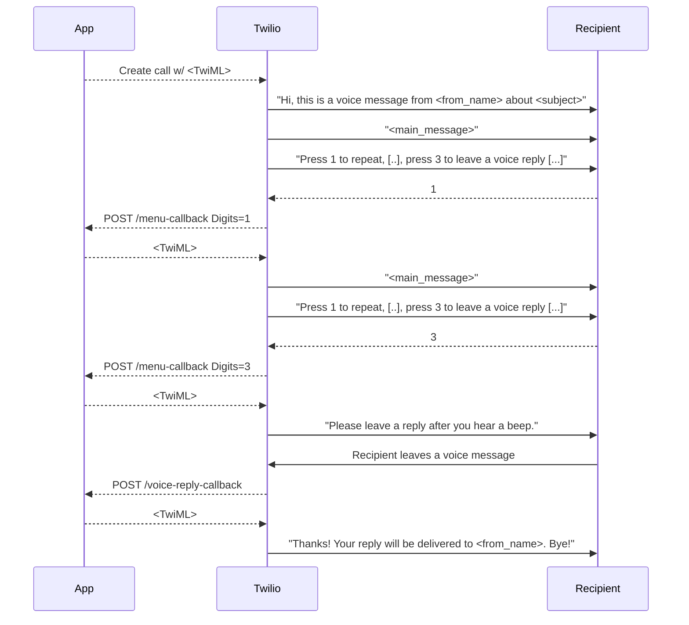

# Interactive Voice Message proof-of-concept

Phone calls become my bane of existence when I need to make them or take them;
Synchronous communication is riddled with scheduling challenges, I never know
when I'm expected to speak, I feel rushed to make decisions on the spot, and
something about the human voice transmitted over a phone call hurts my ear.

So I go to great lengths to avoid them, yet every few years, I find myself in
a spot where I have no way out other than to use the phone.

However, the last time when I found myself in such a spot, I found a new
way out: leave an auto-generated voice message with Twilio. This works with
landline phone numbers, as long as there's someone who picks up the call
and takes note of the message. Twilio is even capable of providing the recipient
with an interactive voice menu that lets them listen to the message again or
record a voice reply in return.

This repo holds a somewhat cleaned up version of the code that I used (and hence untested).
In order not to give the impression that this is maintained code, there's no
detailed getting started guide, but what you'd need are...

* A Twilio account (free) with a Twilio number (a US number costs something like
  $1/mo for a US resident at the time of this writing)
* An ngrok account (free) - or a way to run the app at an address reachable
  from Twilio's servers

Once these accounts' info is set up in your env vars and a `config.toml` is
populated with the content of the voice message, you run `app.py`, visit its
local address, and press the "Send interactive voice message" button to start
the call.

While this method of sending a voice message actually di work when I tried it
(to ask for a refill of my dog's medication), I don't know of its legality.

But companies have long automated their work with [interactive voice response][];
interactive voice message can be a way to free ourselves of establishments that
don't support asynchronous communication channels like email.

[interactive voice response]: https://en.wikipedia.org/wiki/Interactive_voice_response

## Diagrams

The interactive menu is hardcoded to have three choices:

1. Listen to the message again
2. Get the caller's email address
3. Leave a voice reply

The voice reply will be availabe in Twilio's console.

Sequence diagram of a scenario where the recipient presses 1, then 3 to leave
a voice reply:

